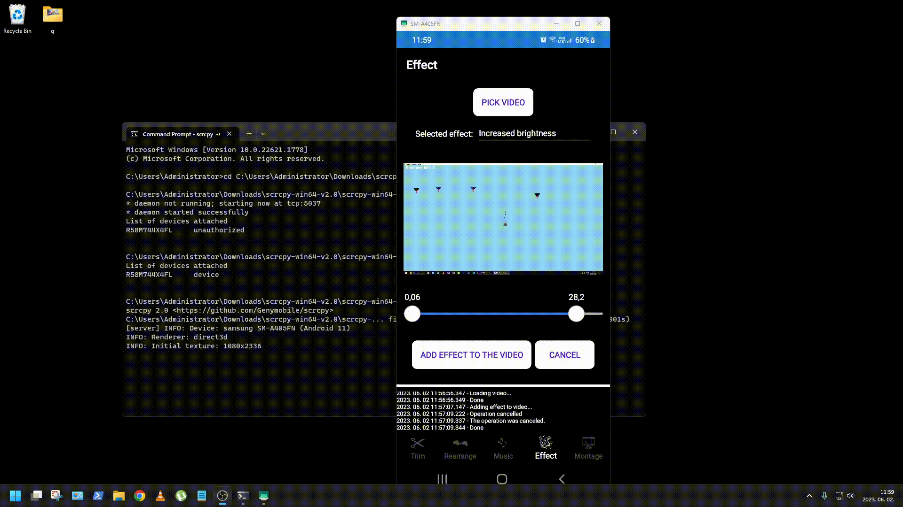

# VideoEditor

VideoEditor is a cross-platform video editing application developed using Xamarin for UWP, Android, and iOS platforms. It allows users to perform various video editing operations such as trimming, cropping, adding effects, and more. The project was initially developed as a final thesis for my Bachelor's degree and showcases the implementation of a video editing application using Xamarin.

## Technologies Used (Or Understanding needed for the project)
 - C#, Python, Flask, REST API, Back-End Development, Micro Web Frameworks
 - .NET, Visual Studio, Git, NuGet, NUnit, OOP, Cross-Plaform Development
 - Xamarin, Xamarin Shell, Xamarin Community Toolkit, MAUI, XML (XAML), Front-End Development
 - MVVM, Dependency Injection, Dependency Service, Singleton Pattern
 - Android (Java), ART, ADB, iOS (Swift), AVFoundation, UWP (C#)
 - UML, Microsoft Visio (Modelling Software), Adobe PhotoShop
 - GNU/Linux, Ubuntu, WSL (Windows Subsystem for Linux), Networking, Bash, FFmpeg, Xabe.FFmpeg, (Traffic) Routing

## Why?

The aim of this code was to design and implement a cross-platform video editing application using Xamarin for UWP, Android, and iOS platforms. The UWP implementation adheres to the originally set specifications, while modifications were made to the initial specifications for the iOS and Android platforms. These modifications involved outsourcing video processing operations to a development server. The original specifications are partly awailable if you know who I am and where to search for my final thesis.

At the time of the thesis, there were no existing cross-platform video editing applications for UWP, Android, and iOS platforms implemented using Xamarin. Hence, the project's implementation using Xamarin is considered sufficient as a final thesis. Although Xamarin support ended on May 1, 2024, its successor, .NET MAUI, provides a similar functionality and allows developers to migrate their code from Xamarin.Forms to .NET MAUI. The thesis includes a decision process and its results, justifying the use of Xamarin.Forms technologies during development instead of .NET MAUI.

The implementation of the project builds upon the knowledge acquired during my university bachelor's degree. It utilizes engineering and IT skills to solve an engineering problem, demonstrating my capabilities in solving real-world challenges.

In this project, we were able to gain insight into the design and implementation of a cross-platform video editing application using Xamarin for UWP, Android and iOS platforms. The user interface was realized according to the planned drawings and plans. After learning how FFmpeg works, the UWP implementation was implemented according to the original plans, while the Android and iOS implementation was implemented according to the revised plans and a development server processes the data. The development server is a GNU/Linux operating system with an Ubuntu distribution running on the GNU/Linux subsystem of a Windows 10 operating system. The server uses the Flask micro web framework to implement REST API functionality. The developer server for Android and iOS implements the same functionality as the UWP implementation, only with a different method. FFmpeg libraries are used for both approaches. We call the FFmpeg libraries directly on the server, while in the case of the UWP implementation we access FFmpeg via the Xabe.FFmpeg package. An Internet connection is required for both implementations: on UWP using Xabe.FFmpeg to download the FFmpeg binary executable, and on Android and iOS to access the development server on the local network.

The logical and user interface control elements of the program were separated from each other during the cross-platform development using the implementation according to the MVVM architecture. Looking at the implementation retrospectively, the waterfall model was suitable for the organization of project activities, it would have been an unnecessary overcomplication to use a more complex software development model, even with unexpected changes to the plans. The video editing application was completed as expected for the set specification, the development of the application was successfully completed.

## Usage 

To use the VideoEditor application, follow the instructions below:

1. Clone the repository: <code>git clone https://github.com/kaszasat/VideoEditor-XAMARIN.git</code>
2. Open the solution file in Visual Studio or your preferred development environment.
3. Build the solution to restore NuGet packages and compile the code.
4. Select the desired platform (UWP, Android, or iOS) and deploy the application to the corresponding emulator or device.
5. Once the application is launched, you can explore the various video editing features and functionalities provided by VideoEditor.
6. (Optional) Configure the client (iOS, Android) and the server for the connection.
7. (Optional) Run the <code>VideoEditor/VideoEditor.Server/VideoEditor.Server.py</code> in your GNU/Linux operating system.

For the GNU/Linux server make sure that:
1. Python 3 or above is installed.
2. FFmpeg is installed.

Once you have successfully installed Python 3 and FFmpeg, you can proceed with the configuration of the application and utilize it's tools as needed.

## Implemented functions

1. Video Trimming: Allows users to trim or cut out specific sections of a video. This feature is helpful for creating shorter clips from a longer video.
2. Rearrange Video Clips: Enables users to reorder video clips within the sequence. It allows for easy rearrangement of scenes or shots to create a desired sequence or flow.
3. Add Audio to Video: Lets users import audio files and synchronize them with their videos. This feature enables users to add background music, voiceovers, sound effects, or any other audio elements to enhance the video.
4. Create Montage from Pictures: Enables users to create a video montage by combining multiple pictures together. This feature resulting in a dynamic slideshow or presentation.

Now, let's go over the implemented video effects:
- Black and White: Converts the video to grayscale, removing all color information and displaying only shades of black and white.
- Grayscale: Similar to black and white, it converts the video to grayscale. However, it may retain some color information, resulting in a desaturated look.
- Sepia: Gives the video a warm, nostalgic tone by applying a brownish tint, reminiscent of old-fashioned photographs.
- Darken Video: Decreases the overall brightness of the video, making it appear darker.
- Lighten Video: Increases the overall brightness of the video, making it appear brighter.
- Increased Contrast: Boosts the difference between the light and dark areas of the video, making the image appear more vibrant and defined.
- Sharpen
- Laplace Edge Detection: Enhances the edges and details in the video by applying a sharpening filter based on the Laplace edge detection algorithm. This effect makes the edges more pronounced and the image clearer.
- Blur: Applies a blur effect to the video, reducing the sharpness and creating a softer, more diffused appearance. This effect can be adjusted to control the degree of blurriness.
- Edge Enhancement: Emphasizes the edges in the video, making them more defined and prominent. It can give the footage a distinct, stylized look.
- Emboss: Adds a highlight or shadow to each pixel, creating an embossed or 3D-like effect. This effect simulates the appearance of raised or carved surfaces.
- Add Red Color to Shadows: Increases the intensity of red tones specifically in the shadow areas of the video, enhancing the warmness and depth of shadows.
- Blue Color Increase Slightly: Enhances the blue tones in the video, adding a subtle coolness to the overall color balance.
- Vintage: Applies a vintage or retro look to the video, typically by adding a combination of color grading, vignetting, film grain, and other effects that mimic the aesthetics of older film stocks.
- Denoising: Reduces or eliminates noise and graininess from the video, resulting in a cleaner and smoother appearance.
- Weak and Strong Deblock (Sharp Edge Smoothing): These effects smooth out sharp edges in the video, reducing blocky artifacts and enhancing the overall visual quality. The weak deblock effect applies a mild smoothing, while the strong deblock effect provides a more aggressive edge smoothing.

These features and effects provide users with comprehensive video editing capabilities, allowing them to trim and arrange their footage, add audio, create montages, and apply various effects to achieve their desired creative vision.

## Acknowledgments

I would like to express their gratitude to the faculty, advisors, and mentors who provided guidance and support throughout the development of this project. Special thanks to the open-source community and the contributors of the libraries and frameworks used in this project.
 - https://github.com/FFmpeg/FFmpeg
 - https://github.com/tomaszzmuda/Xabe.FFmpeg
 - https://nunit.org/
 - https://github.com/AlDanial/cloc
 - https://github.com/github/linguist
 - https://github.com/rochacbruno/flask-powered
 - https://www.ffmpeg.org/about.html
 - https://dotnet.microsoft.com/en-us/apps/xamarin
 - https://github.com/Genymobile/scrcpy
 - https://obsproject.com/

## Project Status
The VideoEditor project is no longer actively maintained. However, the code is available for reference and educational purposes.
The server runs on localhost. The server was never meant to be operated/accessed outside of a development environment, thus the code reflects that.
The code meant to demonstrate that a video editing application can be developed using Xamarin for UWP, Android, and iOS platforms.
